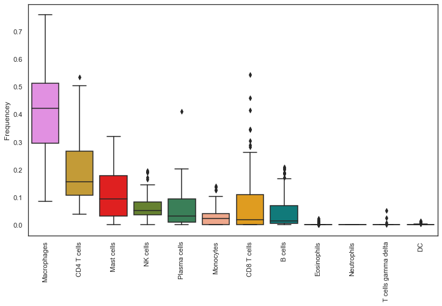

# Week 1
# Vizualization
I started by downloading gene expression data of UVM patients from cBioPortal. Then I used this data and filled in the missing hugo symbols using the genecard website. Next, I used this data in the cibersort x website to produce immune system data. The outputs were various types of immune cells and their frequencies. I then used this data with the [TumorDecon package](https://github.com/ShahriyariLab/TumorDecon) to create vizualizations of my results. 

### Frequency Barchart

### Frequency Boxplot

### Heirarchical Clustering

### Pair Plot

# Hugoify
I also created a python script which can be added to the TumorDecon package which will scrape the internet for missing Hugo symbols and replace them in the DataFrame. Still have to confirm wether or not this would be helpful. The method would be placed in the read_rna function where the default action is to get rid of rows with missing hugo symbols. If the search is inconclusive it will just return Nan and the script can just continue with dropping missing values. I made the application multithreaded to speed up the process,it might have machine limitations and other dependencies that might have to be downloaded as well. After completing it will just print to the console how many values it filled in.

# MMExperiments
I created a ipynb with some experiments. I started by using the median gene expression data and creating a BGMM ovar all of the data. Then what I would do is split the data points up into a training and test set and use the predicted class labels from the BGMM to train a decision tree. I would then look at the first decsion node and see which gene it containted. This to me was a way of searching for which genes would increase the entropy the most between the n_components of the mixtures. The result was a gene ZNF628 where the two groups had statistically significant gene expression means. The problem to this aproach was the high dimensionality which made me use the 'diagonal' covariance type. This definitley wasnt the most accurate way to make the GMM so in the next iteration I used PCA. For the pca approach I used a PCA with 3 componenets, I then trained the BGMM on the transformed points and got class labels for each point. Afterwards I did the same thing by training the untransformed data on the full gene expression vector and tried to predict which genes increased entropy the most. My findings from this iteration was that the ATP5G2 gene increaed entropy the most and created a group which was statistically significant from the others. 