# Week 2
## Goals 
Required stuff:
- Split TCGA data up into two groups based off of whether or not they express the BAP1 gene
- Create vizualizations beased on the two groups
- Do the same for the cnv5 gene
- Create density plots for the groups and run non parametric t-tests to see if statistically significant
- Afterwards, continue my experiments by normalizing all of the data
- Make sure to increase PCA components until at least 80% of the variance is explained
- Use  k-NN/GMM to assign classes and do the same thing as before with the decision tree
- See what results I get and then compare them to what I had before

Possible Experiments:
- Use an ensemble of nuSVR models to make predicitons using bagging
- Average each of the predicted beta vectors together based on the weight of their samples
- Weight of samples is generated by using the likleyhood of the point existing in the GMM 
- Each sample contributes to vector weight, each vector weight contributes to the weighted average
- See if it improves the accuracy 

## Visualizations
Below are the graphs for the group of people who have a -1 for BAP1 gene:
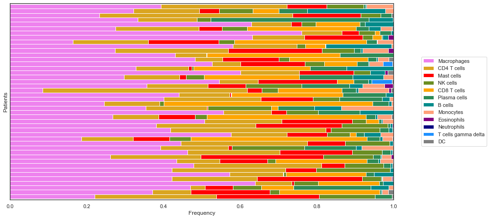
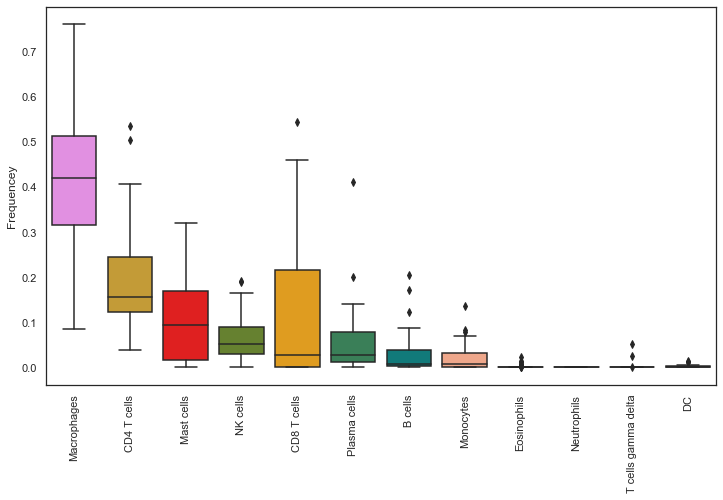
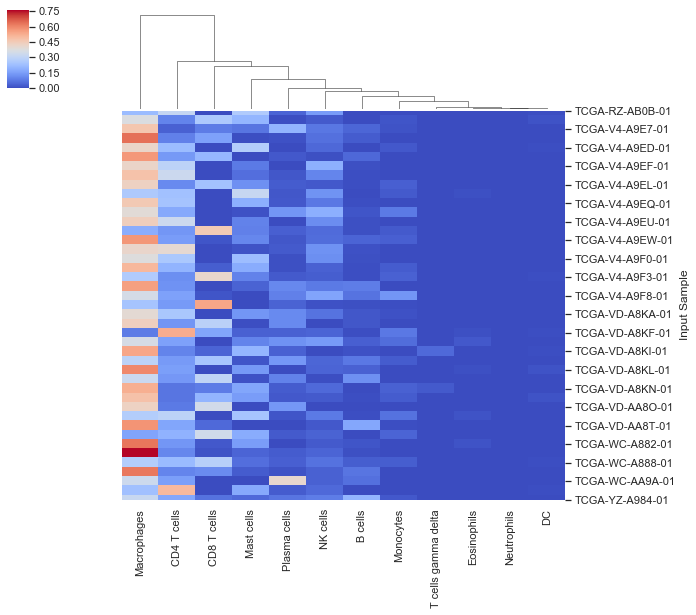
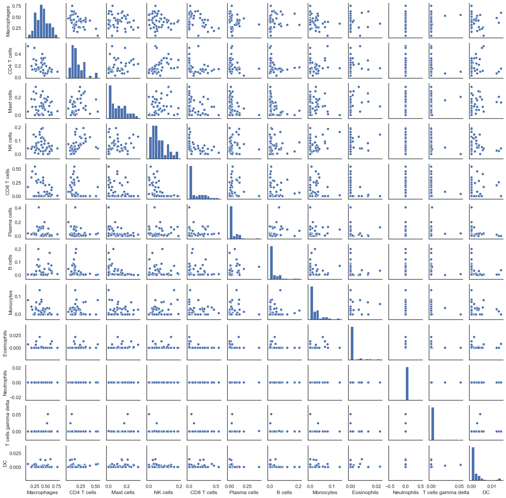

Below are the graphs for the group of people who have a 0 for the BAP1 gene:
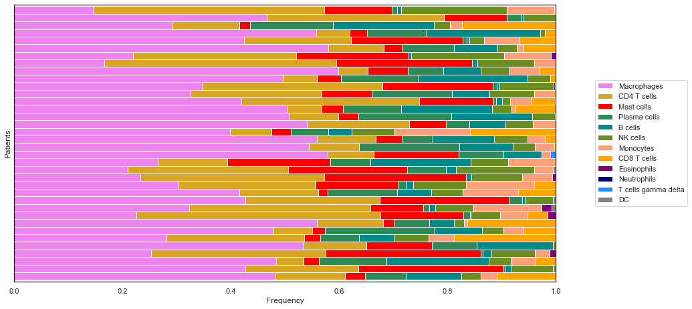
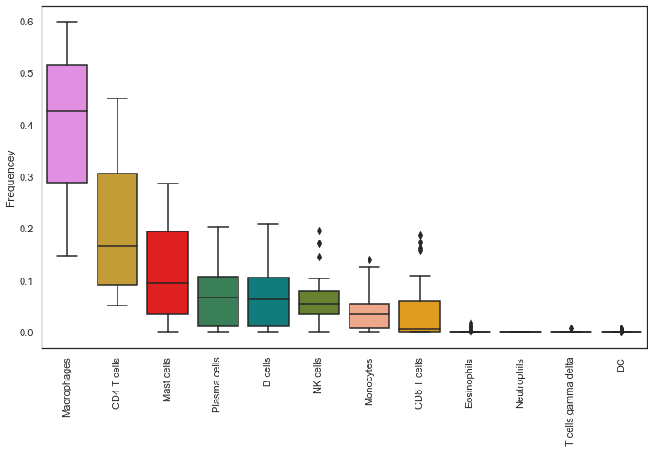
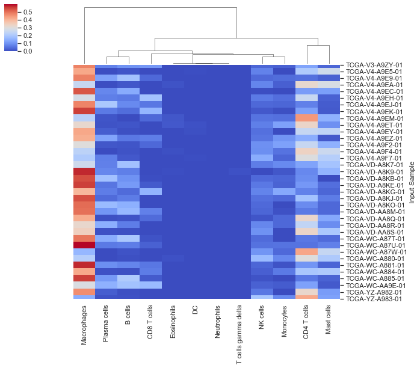
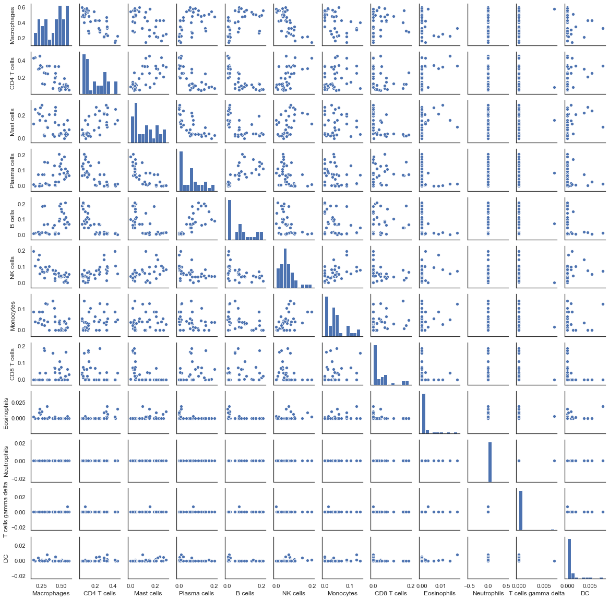

Here is a KDE plot for the gene expression of the two groups:
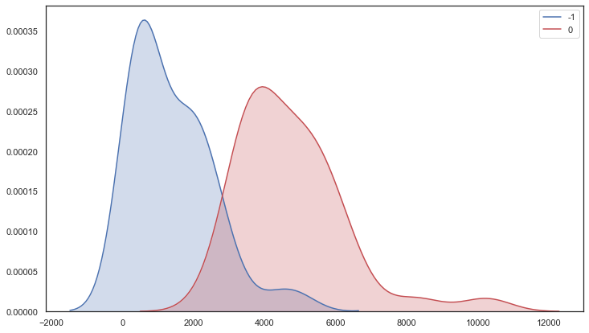

## Revisiting Previous Techniques
Before when I was looking for genes I didnt normalize the data which made it so the values had very large spreads which werent as meaningful. Then I continued with the techniques I had used before. Another adjustment I had made was the increase in the number of PCA components. Before I was only using a couple of components which were only capturing a small fraction of the datas variance. I then increased the number of components to 30 so that at least 80% of the variance was explained by the transformation. After I used the elbow method on a KNN model which assigned classes. The heuristic pretty much gave a range between 3-5. I used 3 because It would make for more distinct and larger groups which meaningful differences could be pulled from. After doing this I did the same thing and just fed the labels and data through a Decison tree and tried to see which genes had the highest entropy between the groups. Some resulting genes were PTPN23 and FAM127C. FAM127C didnt really have any crazy differences between the groups within. However the PTPN23 gene had 3 distinct groups which had very low p values. Looking it up yielded "This gene may serve a tumor suppressor function". Could be interesting??!?! I then graphed the gene by groups determined by their copy number variation. It had 3 groups, 0,1,-1. Groups 0 and -1 seemed not to diverge too much with a p value of .19. The two groups had a low p value (>.008) when compared to the 1 group. 

## NN Deconvolver
Because the CIBERSORT algorithm uses a linear kernel to determine the scaling vector, it assumes that all the relationships are linear. This might not be true however as there mighe be a large array of nonlinear dependencies that interactions casue in the data that it just cant pick up on. Because of that I though that I could use a NN to fix that problem. I had used the simulated data that came with the tumor decon package only so far using the 10:1 noise ratio data. Then I held out 20 of the samples to later be used  for ground truth test data. So what I had was simulated gene expression data and also ground truth simulated data which corresponded to it. Then what I did was took the 80 samples of each and combined them (X1,X2...Y1,Y2...). Then i fit a mixture model to the data. It seemed to work best when I increased the number of components to the number of data points. However this could get prohibitivley expensive. Afterwards I then sampled points from the mixture model, 100,000 points to be exact, and then split the data back up into the train vectors and test vectors. I then fit a NN to the generated data. To test the model I used the 20 held out points to assess MAE. Afterwards I wanted to compare the results to CIBERSORT. I fed the last 20 points through the algorithm to see the results and also produced teh results for the NN. I then used the TD function to combine the columns and then made vizualizations for each of the profiles. Here they are:

Ground truth:
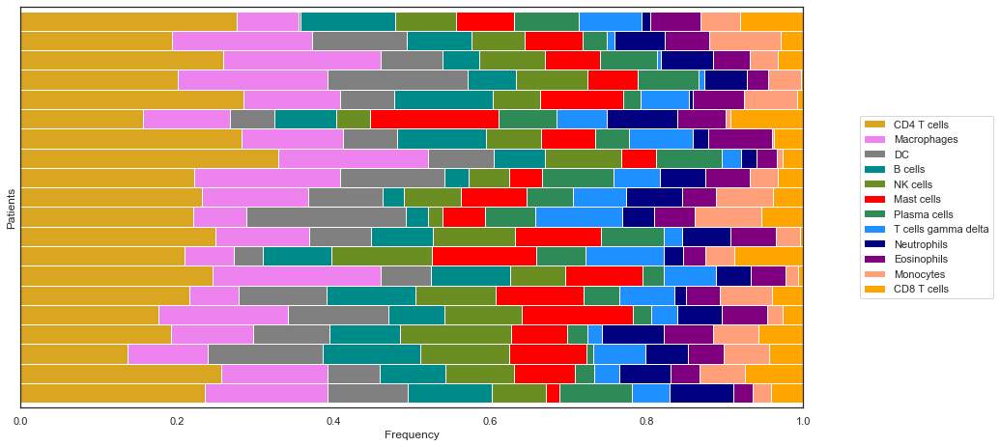

NN Deconvolve:
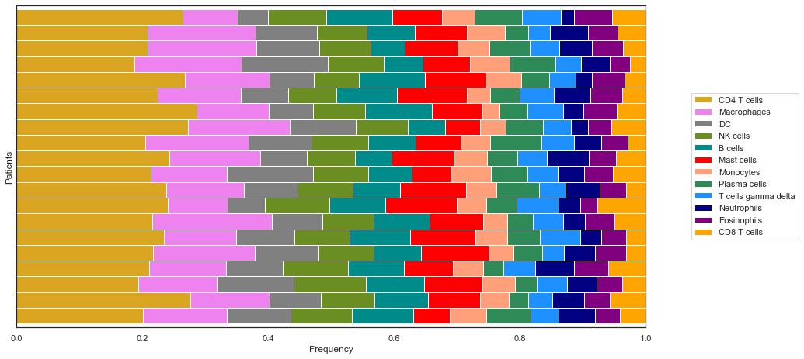

CIBERSORT:
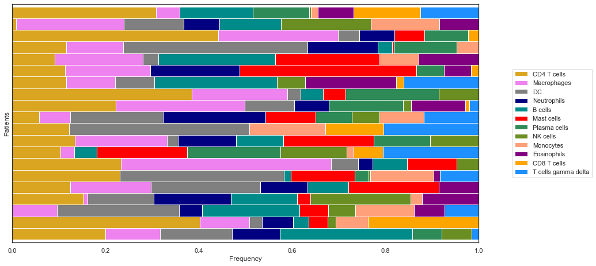

The vizualizations are definitley different from ground truth but the NN is pretty promising. I will have to try it out on another dataset later to see how it performs. To see how much better the predictions were I ended up plotting the predicted values vs the actual values on a line to see how well they correleatd. The idea was that if they were verry close then they would stay along the line of identity and then you could estimate a regression line and also a r correlation. For the CIBERSORT algorithm it got an r correlation of .7086 for the NN deconvolver it got a r correlation of .93292. So pretty good! Again I will have to test it on another dataset while only trained on this generated data to see its robustness. 

Below is the linear model for the NN method:
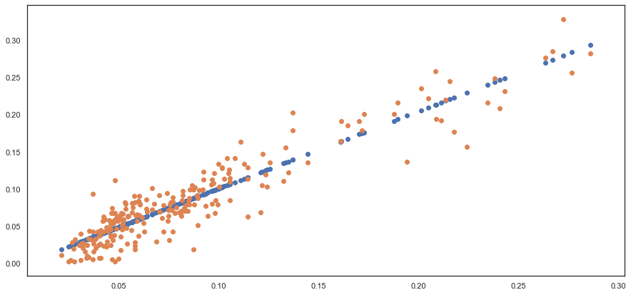

Below is the linear model for cibersort:
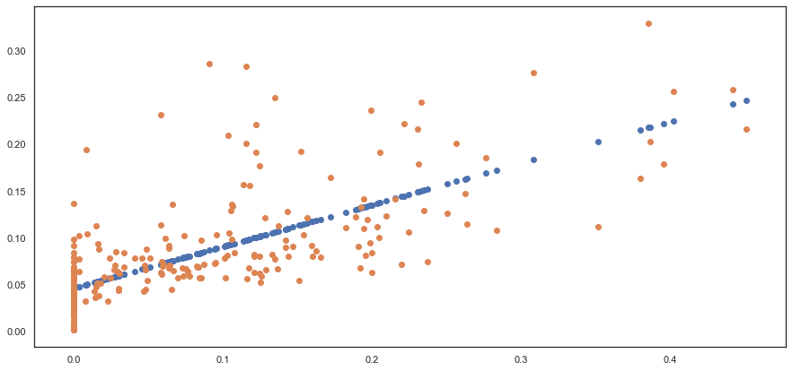