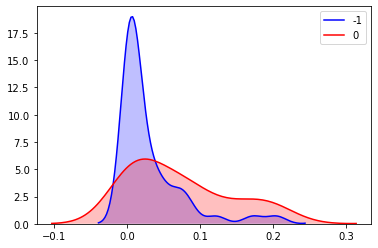
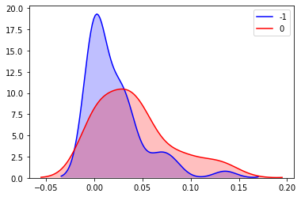
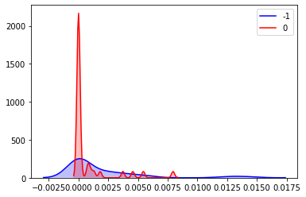
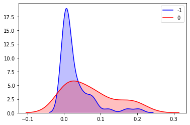
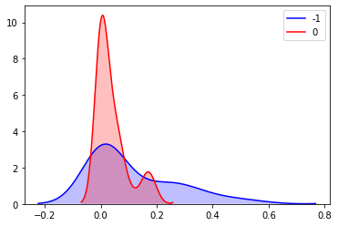
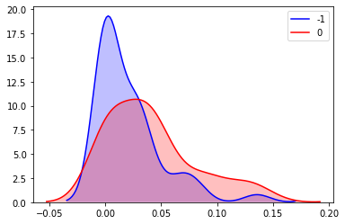
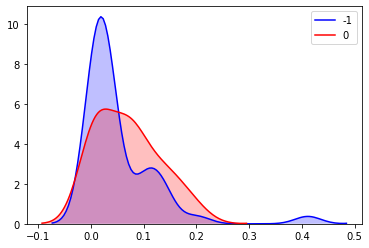
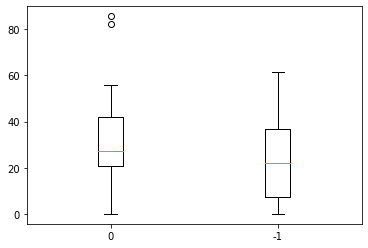
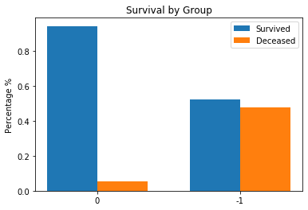
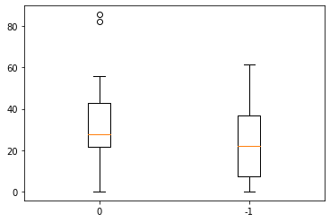

# Week 3
## Goals
- GSEA analysis on the two CNV groups for the BAP1 gene (chose the GO data set and combare both of the results)
- Take the two BAP1 CNV groups and manwhittney the immune cell frequency densities to see if there is a statistical difference
- Check the patients on the skewed part of the bimodial distribution of the PTPN23 gene to see if they have different immune resopnses
- Read UVM paper and validate results
- Read other students paper that leili emailed and do similar analysis on the BAP1 gene with patients age/gender/.... see if there are significant differences

If I have time:
- Check current model on cibersort data and compare results between cibersort algorithm and NN
- Try different archetecture with the singscore algorithm as the input to the NN and then the result being trained on ground truth data
- Do the same for both the singscore and cibersort algorithm as inputs and then checck outputs
- Make functions to generate data based off of cibersort LM22 data 
- Try to make a probabilistic neural net based off of which of the above techniques (Just plain expression data,singscore,or singscore&cibersort) works best at predicting immune response

## GSEA Results
Here are the results from the GSEA applicaiton. I used the c5 gene set database howeber there were many variations of each of the sets. I just chose the all set for each of them.

[v7.1](https://github.com/N8Grant/TripodsREU/tree/master/data/GSEAResults/c5.all.7.1v/index.html)

[v6.2](https://github.com/N8Grant/TripodsREU/tree/master/data/GSEAResults/c5.all.6.2v/index.html)

## BAP1 Gene mutation plots
To test for statistical significance between the -1 and 0 group for the BAP1 genes immune profiles I ran MW tests on each of the immune distributions to try to determine if there was any major difference. Here are the results for the MW tests between -1 and 0 groups:

| Cell Type           	| P-Value  	|
|---------------------	|----------	|
| Eosinophils         	| 0.32645  	|
| Monocytes           	| 0.00292  	|
| Plasma cells        	| 0.1060   	|
| CD8 T cells         	| 0.05311  	|
| T cells gamma delta 	| 0.2062   	|
| B cells             	| 0.00046  	|
| CD4 T cells         	| 0.4101   	|
| NK cells            	| 0.47879  	|
| Macrophages         	| 0.44806  	|
| Mast cells          	| 0.223848 	|
| DC                  	| 0.0433   	|

Here are KDE plots for cell types with low p values between groups:

B Cell:

CD8T:

Monocytes:

DC:

## PTPN23 Gene mutation plots
To test for statistical significance between the -1 and 0 group for the PTPN23 genes immune profiles I ran MW tests on each of the immune distributions to try to determine if there was any major difference. Here are the results for the MW tests between -1 and 0 groups:

| Cell Type           	| P-Value  	|
|---------------------	|----------	|
| Eosinophils         	| 0.4077   	|
| Monocytes           	| 0.00397  	|
| Plasma cells        	| 0.07002  	|
| CD8 T cells         	| 0.06529  	|
| T cells gamma delta 	| 0.2141   	|
| B cells             	| 0.000388 	|
| CD4 T cells         	| 0.3374   	|
| NK cells            	| 0.4353   	|
| Macrophages         	| 0.48622  	|
| Mast cells          	| 0.27850  	|
| DC                  	| 0.05119  	|

Here are KDE plots for cell types with low p values bwtween groups:

B Cell:

CD8T:

Monocytes:

Plasma:

## BAP1 Months of disease-specific survival between groups
Given statistically significant immune responses above there is also a disparity between the DSS_MONTHS between the two groups.

MW p value: 0.03960

There is also a large disparity between the mortality rates between these two groups. The group with the -1 mutation has a far higher mortality rate than the 0 group.

P-value: 3.38147e-05

## PTPN23 Months of disease-specific survival between groups
Given statistically significant immune responses above there is also a disparity between the DSS_MONTHS between the two groups.

MW p value: 0.03583

There is also a large disparity between the mortality rates between these two groups. The group with the -1 mutation has a far higher mortality rate than the 0 group.

P-value: 4.44217e-05

## Simmilarity between PTPN23 and BAP1
Both groups for the BAP1 ang PTPN23 gene have striking similarities in their overlap of outcome distributions. Each of the groups have statistically significant roles to play in phenyotype and also health outcome. Im not sure how this works baut maybe there is something going on here. After analysis 100% of the patients in BAP1 -1 group are in PTPN23 -1 group. Also 97.7% of people in BAP1 0 are in PTPN23 0. I am not entirley sure about the direction of causation or correlation between these two genes, but the overlaps are striking.

## Neural Net Results
Previous experiments were flawed as I mixed up the input for the cibersort algorithm so it was fitting to the wrong inputs. Actual results were not as impressive for the neural network technique and actually resulted in a significant decrease in performance a compared to the CIBERSORT algorithm when adjusted. However I am not going to throw this approcah out just yet. I have an inclination that this is just a symptom of overfiting. I want to amend this approach by changing the method by which I  simulate data. There are many other simulated data files in TD which I havent used. So therefore I am only capturing a small portion of the variance in possible outcomes. My inclination is that if I include the other SNR files into the trianing process and then also simulate points based on those then I could get a more promising model. Since I have only used a SNR of 100:5 this model is definitley subject to overfitting. I will try to include these extra points and then run the tests in the same manner.

After the trials of including additional signal to noise ratio data the model still underperforms the CIBERSORT algorithm on a totally seperate test set. However it performs better on the simulation data test set which is definitley a symptom of overfitting. I think that this method is too data hungry to actually perform better than the state of the art models. I mean given the fact that I try to generate data based off of 80 training samples its highly likeley that this is just a data problem. As both Leili and I have stated a better way to do this using neural nets might be to leverage the outputs of other methods first and then fit a model to the new data and then see if it improves outcomes. 