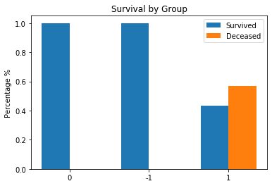
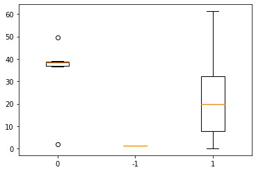
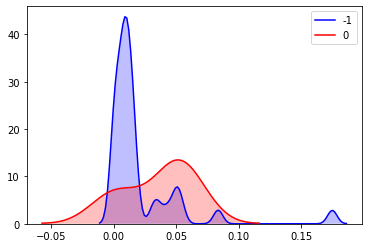
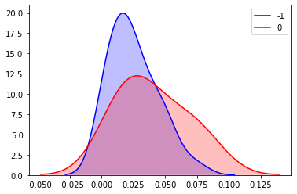
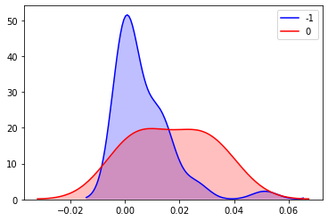
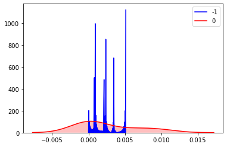
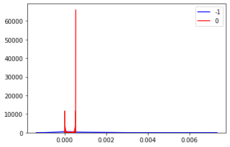
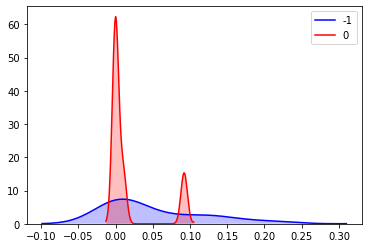
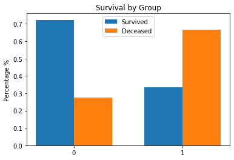
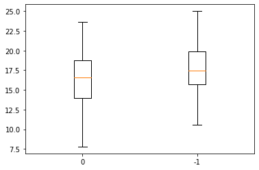

# Week 4
## Goals
- Also use FPKM data to check how cBioPortal came to their results, they claim that the median of the data is used but in another file they use the max. So basically see which transcript sequences are mapped to the same genes and see how they came to the numbers that they got
- Get started on paper

Done:
- Check the patients at the tail ends of the distributions of immune cells to see if any of them show extreme values across multiple immune cell types (ex. at the tail end of both mono and DC cells)
- Check to see if there is a correlation between the immune cell frequency and the  survival of the patients
- Use the FPKM data on usc Xena and perform simmilar analysis as I have already done before to see if any of the transcript level genes could be of interest
- Go over old analysis and check for other genes which showed up with high entropy to see if there was any interesting pathways
- Look at the other characteristics of patients and try to find relationships. 

If I have time:
- Generate data from the LM22 file from cibersort and later the LM22 source file by chosing random scalars for each of the columns of immune cell types and then summing all of the genes values up to reate a mixture sample. Later on introduce noise into the mix by sampling from anormal distribution with a scaled variance and then see how the neural net performs. 

Thoughts:
- Check outlier patient health outcomes

## See outliers with the -1 BAP1 mutations immune responses
Each of the patients in the -1 group have a certain immune cell profile. I am checking to see whether these patients have multiple extreme values for their gene mutations. To Do this I minmax scale their immune responses and then sort by a certan type of gene. Then I look at the other immune cell types to see if they are also relativley high. For teh BAP1 -1 type I checked patients with abnormally high fractions of CD8 T cells B cells Monocytes and DC. I then sorted by the scaled values and then checked their other sceled fractions. One interesting patient was TCGA-V4-A9F8-01 who had abnormally high levels of Monocytes and also very high levels of NK cells. Another patient was TCGA-VD-A8KL-01 who had high levels of DC cells and also a higher than average fraction of Macrophages being within the 5th highest patient.

I assume that the PTPN23 results will be very similar because there is almost entire overlap between these groups. For this reason I wont do an alysis on these subsets because it wont yield any different results.

These two patients observed no different health outcomes than the others with the same mutation. They both survived about 20 months and are living which doesnt make them particuarly interesting outliers.

I am now thinking how I can further seperate these groups from those who died and those who lived within the -1 BAP1 group. I will do the same thing as before and use decision trees to find high entropy decisions. So what I will do is use the mutation data instead and the labels will be living or deceased, 1 or 0. Maybe within the groups I can find another gene which might signifiy a pathway which distinguishes the groups even more. TBC

## Try to Identify New Pathways
One gene that I found in the BAP1 -1 subgroup which "seems' do decrease surviveabilit y is DCHS2 while the p-value tests dont seem to have very low values, the visualizations start to paint a different picture. The variance in disease survival months is decreased significantly between the -1 group and the 0 group.  

Another gene that I found was the POMK gene. This gene yeilded statistically significant results in both the DSS and also the surviveability. So as a subset of patients it might be interesting to look at. There were 3 groups, 0, -1, and 1. The -1 group only contained one patient so it might not be as interesting to look at. The 0 group had 6 patients, all of who survived, and the 1 group had 37 16 of whom survived and 21 who did not. After running a proportion test on these numbers, the p value was .00988. As for the DSS teh two groups had a p-value of .04457. Sample size is definitley a big factor here, but if there are differences that large just based off of a couple of samples then there may be something here. POMK by itself was also identified as a high entropy gene in both the ensemble findings and also the hugo findings.

Survival Rates of the two groups:

Disease Specifice Survival of two groups:

After more exploration the gene POTEA also shares the same subset of people with the same statistical test and so on. This gene however says it is "Prostate, Ovary, Testis-Expressed Protein On Chromosome 8". Genecard also states "Cancer/Testis Antigen Family 104, Member 3".

The gene HGSNAT also shares the same groups as above but has a possibly more interesting genecard description. It describes "Among its related pathways are Innate Immune System and Metabolism". This makes me think if these patients might have a difference in immune response. I will check to se if the 6 people in the 0 group have differences in immune cell concentrations. 

Question: Is it worth clustering on the subset of the patients that has the BAP1 -1 mutation again to find more high entropy genes to try to identify pathways or is this a dead end?

## Immune cell differences in BAP -1, (0,1) HGSNAT patients

| Cell Type           	| P-Value  	|
|---------------------	|----------	|
| Eosinophils         	| 0.02434  	|
| Monocytes           	| 0.03477  	|
| Plasma cells        	| 0.10666  	|
| CD8 T cells         	| 0.080506  |
| T cells gamma delta 	| 0.2500   	|
| B cells             	| 0.20505  	|
| CD4 T cells         	| 0.2362   	|
| NK cells            	| 0.10039  	|
| Macrophages         	| 0.493008  |
| Mast cells          	| 0.49300 	|
| DC                  	| 0.0661   	|

Plasma Cells:

NK Cells:

Monocytes:

Eosinophils:

DC:

CD8 T Cells:

## Correlation Between BAP1 -1 Immune Cell Fractions and DSS
There was no correlation between the immune cell fractions of patients and their disease specific survival time. There was also no correlation between the immune cell fractions and the patients outcome within the BAP1 -1 group. The same applies for the PTPN23 gene because they cover the same patients. 

## Find High Entropy tRNA
Here I will do similar analysis as I have done with the median expression data. I will take the values for tRNA expression and then use PCA for dimensionality reduction. Then I will use k-means to cluster the groups together and produce labels. Using the labels I will fit a decsion tree to it and then look closer at the genes which have high entropy, or those which are good at seperating the individual clusters. 

I used a total of 23 components for the PCA analysis and I used 3 for the K hyperparameter for K means. 

Here are a list of high entropy tRNA:
- ENSG00000155545 --> MIER3
- ENSG00000069399 --> BCL3
- ENSG00000157107 --> FCHO2
- ENSG00000146147 --> MLIP
- ENSG00000113658 --> SMAD5
- ENSG00000196154 --> S100A4 
- ENSG00000130175 --> PRKCSH 
- ENSG00000260423 --> LINC02367 
- ENSG00000122008 --> POLK
- ENSG00000140105 --> WARS1 
- ENSG00000015479 --> MATR3 
- ENSG00000100379 --> KCTD17  
- ENSG00000110400 --> NECTIN1
- ENSG00000165338 --> HECTD2
- ENSG00000146147 --> MLIP 

Because of the innacuracies of the conversion to hugo symbols I will wait in checking immune differences between these three groups.

The gene POLK also shows up in the analysis done on the median gene expression data. 

After normalizing the data with minimax, because I forgot again... I ran analysis again. This time I had to increase the number of components in the PCA to 43 to reach 80% of variance explained. The elbow was pretty much in the same spot so the number of clusters remained at 3. Here are some of the resultsing high entropy ensemble genes:

- ENSG00000143971 --> ETAA1
- ENSG00000131378 --> RFTN1
- ENSG00000124279 --> FASTKD3
- ENSG00000135454 --> B4GALNT1
- ENSG00000126775 --> ATG14
- ENSG00000178974 --> FBXO34

Just because of the podcast on autophagy that I watched I am going to look further into the ATG14 gene which is responsible for autophagy at some level according to ensembl. After digging into some results I found that there seemed to be a difference in the proportion of patients who were deceased between the 0 and 1 groups. However teh test had a p value of .14 probably because of the couple of patients that are in the 1 group. 

Question: Why not cluster based off of gene mutations instead of gene expression values since that is that we want to observe differences in afterwerds?

## Checking to see if BAP1 or PTPN23 Are in Any GSEA Pathways
Both of these genes didnt show up in any of the enriched pathways with p value < .1. Not sure if it suggests that they are unimportant or that there is just an undiscovered pathway that these genes might take a role in.

Note: HDAC family of genes showed up a lot in the  BAP1 -1 enriched pathways with HDAC1 showing up along multiple pathways in both GO data set results.

## Averaged or Median???
Given bowth scripts provided I wasnt able to determine whether or not any of the data was simply an average or actully  a median. I couldnt get teh genes data to coencide at all, such that even genes with single occurences dont match up with the data. I tried quite a few jenes and this eesmed to be the case for all of them that I tried. The Xena portal seems to suggest that the data is first averagd if its from the same sample and then combined into a genomic matrix. So maybe if a lab does a couple of tests what we are seeing for that ensemble is already an average and then CBioPortal did the job of combining into a genomic matrix where thay had their own hugo symbol mapping and copies of the same gene were taken at the median value. Not sure if this is a totally accurate interpretation.

## Looking at more Phenotype Differences
Using the dataset of phenotypes from USC Xensa I looked more into the different phenotypes which the patients had across the two BAP1 groups. Since some of the data was nissing for patients I just excluded it if it wasnt there and continued on with analysis. I will only show phenotype differences with p value lower than .1.

tumor_basal_diameter p-value: .075026 -
4 samples were ommited from this analysis

No significant gender differences were shown and everyone who reported race in the studies were white.

## Paper
Just kinda started a doc with some graphs that the other paper had that i Ill need to include in the work. 

Questions: Is there a certain template I should use?
           