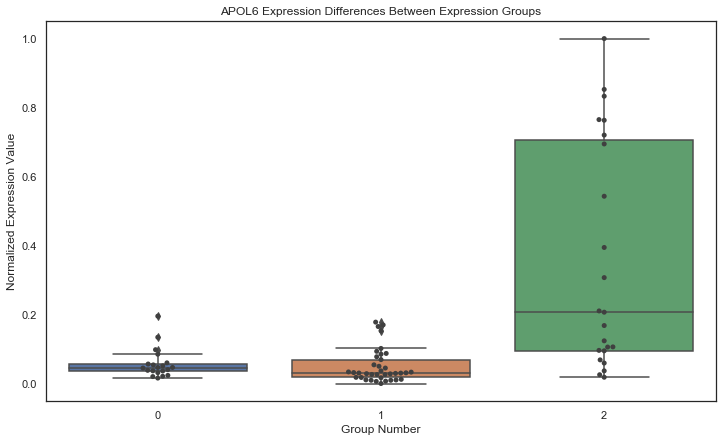

# Week 5
## Goals 
- Check out the postdocs data and see if i can find anything interesting
- Look at RGS5 to find the methods for making many of the graphs
- Make simmilar graphs to the on which the other student has
- Just use a scientific reports template for the paper and start to gather resources and start on that 
- Make a plot simmilar to plot J in figure 1 of the students paper

Done:
- When doing this analysis do PCA reduction and see if the first 10 PCA components have a high correlation with any of the top 10 most variant genes
- Instead of finding high entropy genes, instead find the genes that are most varient across each cluster and determine those to be of possible interest
- See if there is a correlation between BAP1 0 or BAP1 -1 gene expresison levels to immune cell fractions
- See if there is a correlation between the tumor diameter and immune cell concetration both over all of the patients and also within the BAP1 0 and BAP1 -1 groups
- See if the diameter varies based off of the groups of the clusters
- When finding other genes from subgroups do manwhittney test on most variant genes between the two groups and see if MW test yields significant difference between the two gene expression levels
- Put points in box plots
- Highlight negative correlation in B cells with tumor radius
- Title on graphs about the percentages of BAP1 -1 patients in each group
- scatterplot with the APOL family and the CD8T cells for correlation make the hue ofg the points equal to BAP1 group 
- Email cBioPortal to see how they got the numbers they did for the UVM trials from usc xena raw data, but first see if they codes they have for conversion work for determining how they got the data
- Cluster patients based off of immune cell frequency
- Also do immune cell clustering for the subgropus of BAP1 0 and BAP1 1 groups
- See if the diameter varies based off of the groups of the clusters for immune cluster
- Check out manova

## New Notebook
I started a new analysis notebook with the different exploration approach using most variant genes instead of highest entropy genes. This approach yielded very different results which werent as sensitive to initial random state conditions.

## Checking PCA Transformation
I checked to see if the top 10 most variant genes had a high correlation with the transformed output of the PCA. There happened to be no correlation which was very interesing.

## Performing Analysis Based on Most Variant Genes
I clustered the patients based off of their PCA transformed gene expressions. With a total of 3 groups which were of interest. The most varient genes in group 2 happened to include teh genes of the APOL family which is of interest for later. I checked the differences in immune response between the three groups to see if the clusters yielded any significant diferences. Here are the results of these three clusters. 

In earlier analyisis it showed that there were statistical differences in B cells between patients with the BAP1 mutation. Here that same difference shows up between group 2 and the other two groups. I then tried to see if there was a correlation between the patients BAP1 expression and any of the immune cells:

Cell        |   R   |       P-value
- CD8 T cells  : -0.3372397575435077 0.0022204870595993503
- Monocytes  : 0.2525139475815361 0.023836013545074187

## Testing Health Outcomes
Here I tried to see if there were any correlation between cells of interest to health outcomes. I found these differences amongst all patients: 

- negative correlation between the CD8 T cells and the patients living status with a p value of 0.000192 and R of -0.4051 
- positive correlation between monocytes and the patients living status with p value 0.01163 and R 0.28079
- positive correlation between mast cells and disease survival time with p value .0595 and R of .21155
- negative correlation between B cells and tumor basal raduis with p value .00855 and R of -0.29962

Correlation conditioned on BAP1 subgroups:

0 Patients Observations:
- B cells still have a negative correlation with tumor radius with p value 0.0084935 and R -0.4442 which has an even greater magnitude
- CD4 T cells have positive correlation with tumor radius with p value .025175 and R 0.38346
- CD8 T cells have negative correlation with DSS time with p value of .02512 and R of -0.38358

-1 Patients Observations:
- No stat significant differences for immune cells on tumor size
- NK cells have positive correlation with DSS time with p value .0533 and R of .300218
- CD8 T cells have negative correlation with living status with p value 0.02063 and R of -0.3479
- Monocytes have positive correlation with living status with p value .03270 and R of .322596
- Mast Cells have positive correlation with living status with p value .05187 and R of .30205

Correlation conditioned on cluster groups:

Group 0 Patients:
- No significant correlation between immune cells and DSS time
- Negative correlation between B cells and tumor radius with p value .007016 and R -0.61140
- No significant correlation between immune cells and living status
- Negative corralation between DC and weight p value .0349724 and R -0.5932

Group 1 Patients:
- Negative correlation between CD8 T cells and DSS time with pvalue .01516 and R -0.39632 
- Negative correlation between CD8 T cells and living status with pvalue .03705 and R -0.344067 
- Negative correlation between Plasma cells and weight p value 0.034972 and R -0.43210

Group 2 Patients:
- No significant correlation between immune cells and DSS time
- Positive correlation between B cells and tumor radius with p value .02782 and R .468591
- No significant correlation between immune cells and living status
- No significant correlation between immune cells and weight

Interesting because the two most distinct groups in terms of BAP1 -1 and immune cell wise also have differences in tumor radius which dont come up in all patients. Actually this is really cool because the two groups actually have opposite reations to B cells and tumor radius.

## Testing tumor diameter besed on group
There seemed to be no difference between the radius of the tumor between groups. Next I checked to see if there were differences between BAP1 groups 0 and 1 and there was almost a statistically significant difference between groups however p value was .075.

## Finding Highly Correlated Gene Expression with Immune fractions across groups
| Gene Name   | Cell Type | R Value        	| P-Value  	| Group High Variance |
|---------------|--|----	|----------	|---|
| ABCA10 | B cells | 0.28179200116084185 | 0.011331764941285476 |0|
| ARMC2 | DC | -0.22787830060802805 | 0.04205668991485489 |0|
| ARMC2 | Macrophages | -0.2567775643494701 | 0.021491405011294488 | 0|
| ASB14 | B cells | 0.25728130616487593 | 0.02122786101474487 | 0|
| ASB14 | CD8 T cells | -0.280564472968391 | 0.011708822989887166 | 0|
| C17orf98 | B cells | 0.3587043443177811 | 0.0010857382698643964 | 1|
| C17orf98 | Mast cells | -0.22558303876555844 | 0.044226846085515234 |1|
| DUSP9 | B cells | -0.23297757600853877 | 0.03755027754285113 |1|
| FBXO17 | CD8 T cells | -0.3317586091836562 | 0.002644712254017059 |1|
| FBXO17 | Monocytes | 0.23272754229542975 | 0.03776143848833793 |1|
| FSCN3 | CD8 T cells | -0.2524472549402552 | 0.023874351191423032 |1|
| FSCN3 | NK cells | 0.23119047814182087 | 0.03908140648396584 |1|
| H2AFY2 | B cells | 0.3046289760925882 | 0.006006479549340465 |1|
| H2AFY2 | CD8 T cells | -0.29182930375403293 | 0.00862529676482781 |1|
| KRT27 | T cells gamma delta | 0.28045197768360464 | 0.011743917701267191 |1|
| OR2A25 | Eosinophils | 0.3055488211812461 | 0.005848735239136408 |1|
| OR7E156P | Mast cells | 0.3364644069654985 | 0.0022765227333401477 |1|
| PI4KAP2 | B cells | -0.22745484949453354 | 0.04245027575947436 |1|
| ADAM6 | CD8 T cells | 0.4113033813185073 | 0.00015058694212911815 |2 |
| ADAMTS12 | Plasma cells | -0.2932908994563443 | 0.008282708116586322 |2 |
| ANGPTL5 | CD8 T cells | 0.3263605824506928 | 0.0031320931188003396 |2 |
| ANGPTL5 | DC | 0.2213148602203554 | 0.04850875093562445 |2 |
| ANGPTL5 | Macrophages | -0.2272957830060853 | 0.042598910681574655 |2 |
| APOL1 | CD8 T cells | 0.8163860356692565 | 2.762926954987246e-20 |2 |
| APOL1 | NK cells | -0.27659581357445684 | 0.013003530796095434 |2 |
| APOL2 | CD8 T cells | 0.8018537006318256 | 4.0082482629661557e-19 |2 |
| APOL2 | NK cells | -0.3430276319107869 | 0.0018398407405781894 |2 |
| APOL3 | CD8 T cells | 0.7939840959700966 | 1.5581715168079523e-18 |2 |
| APOL3 | NK cells | -0.2539149736433083 | 0.023042667466156786 |2 |
| APOL6 | CD8 T cells | 0.8456891478420271 | 5.659783786455629e-23 |2 |
| APOL6 | NK cells | -0.28219935910650606 | 0.011208995443202658 |2 |

## Differences Between Groups High Variance Gene expresions
| Gene Name   | Group 1 | Group 2        	| P-Value  	| Group High Variance |
|---------------|--|----	|----------	|---|
| SZT2 | 0 | 1 | 1.4168483349797699e-05 | 0|
| SZT2 | 1 | 2 | 0.0003746730269511046 | 0|
| A4GNT | 0 | 1 | 8.564878672376923e-07 | 0|
| A4GNT | 1 | 2 | 0.00026372618054553923 | 0|
| ABCA10 | 0 | 1 | 6.128557887613426e-08 | 0|
| ABCA10 | 1 | 2 | 2.0232053612554402e-09 | 0|
| ACADL | 0 | 1 | 0.004204579455134707 | 0|
| ACADL | 0 | 2 | 0.015406556460516549 | 0|
| DUSP9 | 0 | 2 | 0.0005283613592797177 | 1|
| FBXO17 | 0 | 2 | 2.296286658236114e-08 | 1|
| FBXO17 | 1 | 2 | 5.9874568414734473e-05 | 1|
| H2AFY2 | 0 | 2 | 3.13930068004837e-06 | 1|
| H2AFY2 | 1 | 2 | 0.003102572190670043 | 1|
| ADAM6 | 0 | 2 | 0.04302419804357056 | 2|
| ADAMTS12 | 0 | 2 | 0.011352131825035075 | 2|
| ADAMTS12 | 1 | 2 | 0.04284892804866945 | 2|
| ANGPTL5 | 0 | 1 | 0.008740505467272331 | 2|
| ANGPTL5 | 1 | 2 | 0.0017613597400474813 | 2|
| APOL1 | 0 | 1 | 0.0040213797525728385 | 2|
| APOL1 | 0 | 2 | 1.65119139283993e-05 | 2|
| APOL1 | 1 | 2 | 0.0005696047237191928 | 2|
| APOL2 | 0 | 1 | 0.0024201147795485044 | 2|
| APOL2 | 0 | 2 | 8.42944439487669e-05 | 2|
| APOL2 | 1 | 2 | 0.008492209698290782 | 2|
| APOL3 | 0 | 1 | 0.005926312697957985 | 2|
| APOL3 | 0 | 2 | 1.2623671433692429e-05 | 2|
| APOL3 | 1 | 2 | 0.0007822264032105731 | 2|
| APOL6 | 0 | 2 | 5.143869464961313e-05 | 2|
| APOL6 | 1 | 2 | 7.757016380235177e-07 | 2|

Here is an insight into why the groups might have some difference immune responses or where they are attributable to. To do this I follow these rules.

- 1. The gene has only one passing test meaning that one of the groups is different than the another group but not too different from a third group
- 2. The gene has two passing tests meaning that the test that shows up twice is different than the other two but the other two are pretty simmilar
- 3. The gene has all three passing tests and that means each group has a statistically different amount of this gene

These are all interesting in their own but I think that for the purpose of distinguishing groups and finding out why there is CD8 T differences between groups 0 and 2 it might be best to look at tests which go along with thing 1 and 2. The particular tests which I want to pay attention to are those which involve groups 0 and 1 and also 0 and 2 for rule 2 and groups 0 and 2 for rule 1 if they exist.

| Gene Name   | Group 1 | Group 2        	| P-Value  	| Rule |
|---------------|--|----	|----------	|---|
| ACADL | 0 | 1 | 0.004204579455134707 | 2|
| ACADL | 0 | 2 | 0.015406556460516549 | 2|
| DUSP9 | 0 | 2 | 0.0005283613592797177 | 1|
| ADAM6 | 0 | 2 | 0.04302419804357056 | 1|
| APOL6 | 0 | 2 | 5.143869464961313e-05 | 2|
| APOL6 | 1 | 2 | 7.757016380235177e-07 | 2|

## Correlation Between certain genes and Immune frequencies conditioned on BAP1 group
| Gene Name   | Immune Cell | R        	| P-Value  	| BAP1 Group |
|---------------|--|----	|----------	|---|
| ADAM6 | CD8 T cells | 0.5002734474442355 | 0.0018892995594385778 |0|
| ADAM6 | CD8 T cells | 0.3900530866498074 | 0.008859912095894883 |-1|
| ACADL | B cells | 0.3708614527273221 | 0.013201677334340517 |-1|
| DUSP9 | Eosinophils | -0.3597974323301224 | 0.016445857039200446 |-1|
| APOL6 | CD8 T cells | 0.644121112544345 | 2.2458562669558957e-05 |0|
| APOL6 | CD8 T cells | 0.846268877796391 | 4.683628290581627e-13 |-1|
| APOL6 | Macrophages | -0.3167369229127191 | 0.03619044330718084 |-1|
| APOL6 | NK cells | -0.38807147216844906 | 0.009242200873019567 |-1|

APOL6 Shows up yet again

## APOL Family
Here I made a pairplot consisting of the APOL family of genes and also CD8T cells. I  condidtioned based on BAP1 group as shown in colors. 

## Clustering Patients Based off of immune fractions
As done in the oither students paper I nopw clustered teh patients based on their predicted immune fractions. I  used PCA to reduce it to a total of 3 dimensions which represened over 80 percent of all the variance. Then I clsutered the patients with a total of 4 clusters. 

Group 0 has 29 patients
Group 1 has 15 patients
Group 2 has 14 patients
Group 3 has 22 patients

Percentages of BAP1 -1 in each group:

- [0.4482758620689655, 0.3333333333333333, 0.7857142857142857, 0.6818181818181818]

## Plots of group Immune fractions
Group 0:

Group 1:

Group 2:

Group 3:

## Significant differences between immune fractions between groups
Here I only have differences for Immune cells which were statistically signifnicntly different across many groups.

Immune group 2 and expression group 2 had the highest overlap of patients which was interesting because they both showed the same CD8 T cells results.

## APOL6 Across Different Groups
Because there was such a ridiculous correlation between the APOL6 gene and the CD8 T cells I had to dive more into it and the results were presty interesting.

Here are the plots for APOL6 gene expression condidtioned on different groups:

Interesting that there is a statistical difference between the two BAP1 groups and the APOL6 gene expression P-value: 5.3701e-05

## Correlation Between APOL6 and CD8 T cell fractions in group 2
There seemed to be a high positive correlation of .7 between the APOL6 gene expression and the CD8 T cell fraction with p-value: .004819

## Correlation Between CD8 T cells and Immune Fractions

| Dependent Variable | R | P-value |
|--------------------|---|---------|
| Age | .179653 |.53884 |
| Tumor Basal Radius | .331623 | .246746|
| Disease Specific Survival time | .539157 | .04663 |
| OS_status | -0.7516 | .001936 |

Interesting that there is a statistically significant difference between CD8 T cells and both DSS and OS status

## Phenotype Differences Across Groups
Since I really want to focus on APOL6 and its possible effect I will only look for differences between group 2 and other groups. It seemed that there were no significant phenotype differences between immune group clusters. When looking outside of just group 2 differences there was a significant difference between the group 0 and group 3 in terms of tumor basal radius which is very interesting and warrants further investigation, but for now I will focus on the APOL6 gene.

## Looking at stages of cancer
There seemed to be no difference between group 2 and the rest of the data points as a whole when it came to the stages which the cancer was at.

## Looking at Most Variant Genes in Group 2
My goal here is to search amongst many of the most variant genes to try to find out if there is another gene which also has very high predictive power as to what CD8 T cells are going to be like. I want to see if there are a couple of genes that when mixed together get this exaggerated response, albeit predictivley. The results werent amazing as the only genes which when combined made for a higher correlation was TAP1 and CCL4.  

Another approach I took was to fit a linear regression model and to see what genes when combined with APOL6 would make for the best prediction of CD8 T cells. The result however is a bunch of genes which seem to have no impact on cd8 t cells, or at least some marginal impact which is harmless and then the APOL6 gene does the heavy lifting and accounts for most of the equations score. 

One interesting result is the gene MPPE1 which also has to do with lipids as does APOL6.

Another interesting result is PRR5L which is another one of the best predictors of CD8 T cells coupled with APOL6. 

## 